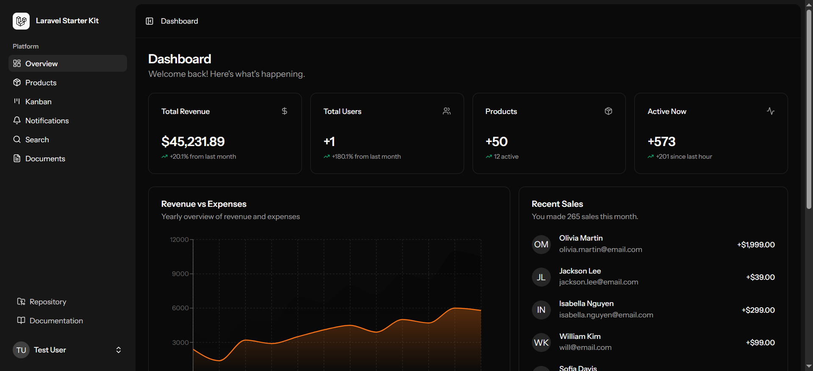
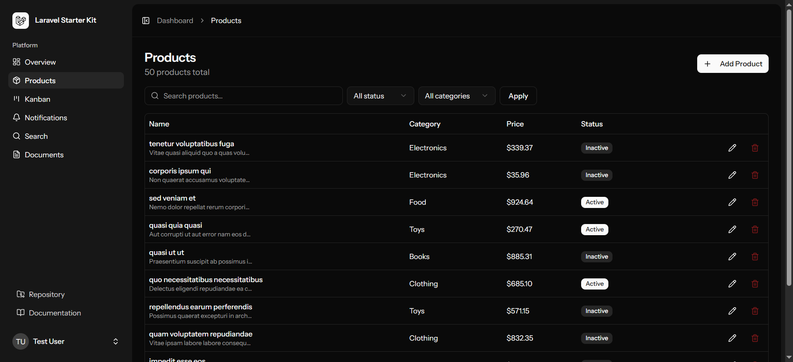
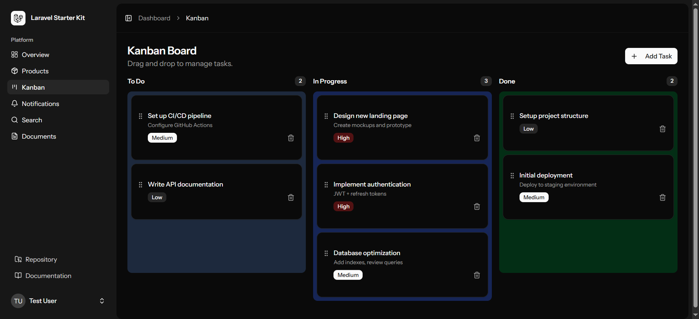
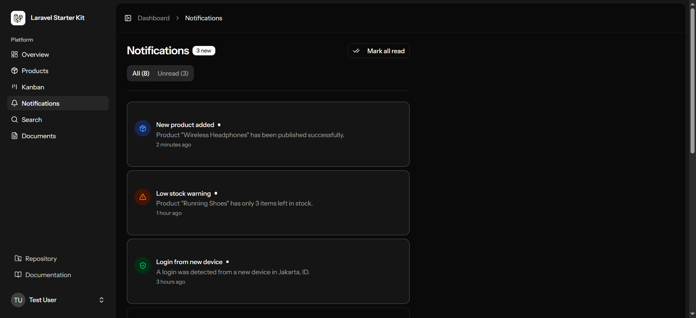

# Laravel Shadcn Boilerplate

A production-ready full-stack boilerplate built with **Laravel 13**, **React 19**, **Inertia.js**, **Tailwind CSS 4**, **Shadcn/ui**, **PostgreSQL + pgvector**, and **OpenRouter AI**.

---

## Stack

| Layer | Technology |
|-------|-----------|
| Backend | Laravel 13 · PHP 8.4 · Fortify · Sanctum |
| Frontend | React 19 · TypeScript · Inertia.js 2 |
| Styling | Tailwind CSS 4 · Shadcn/ui |
| Database | PostgreSQL 17 + pgvector 0.8 (Docker) |
| AI | Laravel AI SDK → OpenRouter (400+ models) |
| Build | Vite · Pest |

---

## Screenshots

### Login


### Dashboard Overview
KPI stats cards, revenue vs expenses area chart, sales by category bar chart, and recent sales list.



### Products
Server-side data table with search, status/category filters, pagination, and inline edit/delete.



### Kanban Board
Drag-and-drop task board with three columns (To Do / In Progress / Done), priority badges, and add/delete tasks.



### Notifications
Tabbed notification center (All / Unread) with mark-all-read and type-colored icons.



---

## Features

### Dashboard
- KPI stats cards (revenue, users, products, active now)
- Area chart — Revenue vs Expenses (Recharts)
- Bar chart — Sales by Category (Recharts)
- Recent sales list with avatars

### Products
- Full CRUD with server-side pagination (10 / 20 / 50 per page)
- Search by name/category, filter by status and category
- React Hook Form + Zod validation on create/edit form
- Sonner toast notifications on all actions
- Confirm dialog before delete

### Kanban Board
- Drag-and-drop via `@dnd-kit` (pointer sensor)
- Three columns: To Do, In Progress, Done
- Add tasks with title, description, and priority
- Zustand state management (client-side)

### Notifications
- 8 sample notifications across 4 types (product, account, security, alert)
- Tab filter: All / Unread
- Click to mark individual as read
- Mark all read button

### Semantic Search & RAG
- Documents CRUD with pgvector embedding via OpenRouter
- Semantic similarity search (`whereVectorSimilarTo`)
- `KnowledgeAgent` RAG chatbot using `SimilaritySearch` tool
- AI chat widget (`/agent/ask`)

### Auth (via Laravel Fortify + Sanctum)
- Login, Register, Forgot/Reset Password
- Email Verification
- Two-Factor Authentication (TOTP)
- Passkeys (WebAuthn)
- Profile & Security settings

---

## Requirements

- PHP 8.4+ (via [Laravel Herd](https://herd.laravel.com/) or Laragon)
- Composer 2.x
- Node.js 20+ LTS / npm 10+
- Docker Desktop (for Postgres container)
- OpenRouter API key → [openrouter.ai/keys](https://openrouter.ai/keys)

---

## Quick Start

### 1. Clone & Install

```bash
git clone <your-repo-url> laravel-shadcn-boilerplate
cd laravel-shadcn-boilerplate

composer install
npm install
```

### 2. Configure Environment

```bash
cp .env.example .env
php artisan key:generate
```

Edit `.env`:

```dotenv
DB_CONNECTION=pgsql
DB_HOST=127.0.0.1
DB_PORT=5434
DB_DATABASE=laravel
DB_USERNAME=laravel
DB_PASSWORD=secret

OPENROUTER_API_KEY=sk-or-v1-your-key-here

AI_PROVIDER=openrouter
AI_TEXT_MODEL=anthropic/claude-sonnet-4
AI_EMBEDDING_MODEL=openai/text-embedding-3-small
```

### 3. Start Database

```bash
docker compose up -d
docker compose ps   # wait for STATUS: healthy
```

### 4. Migrate & Seed

```bash
php artisan migrate
php artisan db:seed        # creates test user + 50 products
php artisan storage:link
```

### 5. Run Dev Servers

```bash
# Terminal 1
php artisan serve

# Terminal 2
npm run dev
```

Open **http://localhost:8000** and log in with:
- Email: `test@example.com`
- Password: `password`

---

## Project Structure

```
app/
├── Ai/Agents/
│   └── KnowledgeAgent.php          # RAG agent via OpenRouter
├── Http/Controllers/
│   ├── AgentController.php         # POST /agent/ask
│   ├── DocumentController.php      # Documents CRUD + embedding
│   ├── ProductController.php       # Products CRUD
│   └── SearchController.php        # Semantic search page
├── Models/
│   ├── Document.php                # pgvector model
│   ├── Product.php
│   └── User.php
├── Policies/
│   └── DocumentPolicy.php
└── Services/
    ├── EmbeddingService.php        # OpenRouter embeddings + pgvector
    └── FileUploadService.php       # Laravel Storage wrapper

resources/js/
├── components/
│   ├── kanban/                     # KanbanCard, KanbanColumn, Zustand store
│   ├── overview/                   # AreaGraph, BarGraph, RecentSales, StatsCards
│   ├── data-table/                 # DataTable (TanStack), DataTablePagination
│   └── ui/                         # Shadcn/ui primitives
├── pages/
│   ├── dashboard.tsx               # Overview page
│   ├── kanban.tsx                  # Kanban board
│   ├── notifications.tsx           # Notifications center
│   ├── search.tsx                  # Semantic search
│   ├── documents/index.tsx         # Documents list
│   └── products/
│       ├── index.tsx               # Products data table
│       └── form.tsx                # Create / Edit form

docker/
└── db/init.sql                     # Enable pgvector + uuid-ossp extensions
docker-compose.yml                  # Single container: pgvector/pgvector:pg17
```

---

## Useful Commands

```bash
# Database
npm run db:up       # docker compose up -d
npm run db:down     # docker compose down
npm run db:logs     # docker compose logs -f db
npm run db:psql     # psql shell inside container

# Laravel
php artisan wayfinder:generate   # regenerate typed route helpers
php artisan make:agent MyAgent   # create a new AI agent
php artisan migrate:fresh --seed # reset + reseed database
```

---

## AI Configuration

Switch models at any time via `.env` — no code changes needed:

```dotenv
# Text generation
AI_TEXT_MODEL=anthropic/claude-sonnet-4
AI_TEXT_MODEL=openai/gpt-4o
AI_TEXT_MODEL=google/gemini-2.0-flash

# Embeddings
AI_EMBEDDING_MODEL=openai/text-embedding-3-small   # 1536 dims (default)
AI_EMBEDDING_MODEL=openai/text-embedding-3-large   # 3072 dims
AI_EMBEDDING_MODEL=qwen/qwen3-embedding-8b         # open-source multilingual
```

---

## License

MIT
